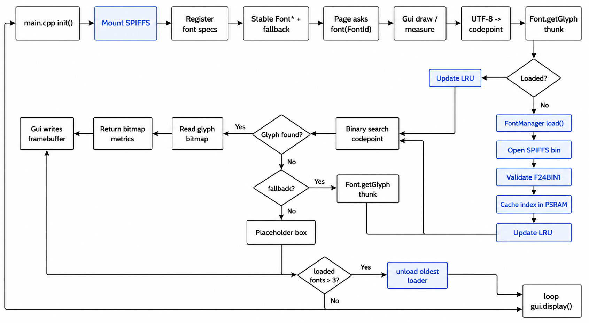

# 项目字体 bin 生成与运行时加载指南

本项目字体统一通过 SPIFFS 中的 bin 文件加载，不再把脚本生成的 C 字模数组编译进固件。

当前运行时入口：

- `src/main.cpp` 只调用 `FontManager::instance().init()`
- `lib/ui/gui/fonts/FontManager.h/.cpp` 负责 SPIFFS 挂载、字体注册、懒加载、fallback、LRU 和状态查询
- `lib/ui/gui/fonts/FontBinLoader.h/.cpp` 负责解析 `F24BIN1` v1 bin、校验 header、缓存索引和读取字形

## 1. 当前字体定义

| 用途 | 源字体 | 字号 | 输出文件 |
| --- | --- | ---: | --- |
| 中文主字体 | `fonts/AlibabaPuHuiTi-3-65-m-Medium.otf` | 24 | `data/font_zh_main_24.bin` |
| 中文副字体 | `fonts/AlibabaPuHuiTi-3-45-Light.otf` | 20 | `data/font_zh_sub_20.bin` |
| 英文主字体 | `fonts/NotoSans-Medium.ttf` | 18 | `data/font_en_main_18.bin` |
| 英文副字体 | `fonts/NotoSans-Medium.ttf` | 16 | `data/font_en_sub_16.bin` |
| 数字字体 | `fonts/NotoSans-Medium.ttf` | 60 | `data/font_digits_60.bin` |

`NotoSans-Medium.ttf` 不包含部分全角中文标点。英文 bin 中这些标点会使用中文主字体补字，避免运行时缺字。

## 2. 字符集

脚本默认额外包含空格 U+0020。

中文字体字符集：

```text
GB2312 一级汉字
!"#$%&'()*+,-./0123456789:;<=>?@[\]^_`{|}~
，。！？：；（）【】《》、℃%±×÷
```

英文字体字符集：

```text
!"#$%&'()*+,-./0123456789:;<=>?@
ABCDEFGHIJKLMNOPQRSTUVWXYZ[\]^_`abcdefghijklmnopqrstuvwxyz{|}~
，。！？：；（）【】《》、℃%±×÷
```

数字字体只生成：

```text
0123456789
```

## 3. 生成命令

从项目根目录执行：

```bash
python tools/gen_project_font_bins.py --target all
```

只生成单类字体：

```bash
python tools/gen_project_font_bins.py --target zh
python tools/gen_project_font_bins.py --target en
python tools/gen_project_font_bins.py --target digits
```

生成后立刻上传 SPIFFS：

```bash
python tools/gen_project_font_bins.py --target all --uploadfs
```

当前正常输出元数据：

```text
font_zh_main_24.bin: glyphs=3815 maxGlyphBytes=72 fileSize=334752
font_zh_sub_20.bin: glyphs=3815 maxGlyphBytes=60 fileSize=288984
font_en_main_18.bin: glyphs=112 maxGlyphBytes=54 fileSize=5978
font_en_sub_16.bin: glyphs=112 maxGlyphBytes=48 fileSize=5216
font_digits_60.bin: glyphs=10 maxGlyphBytes=360 fileSize=3824
```

## 4. 打包和刷入

生成 SPIFFS 镜像：

```bash
pio run -e esp32s3box -t buildfs
```

编译固件：

```bash
pio run -e esp32s3box
```

上传固件：

```bash
pio run -e esp32s3box -t upload
```

上传 SPIFFS：

```bash
pio run -e esp32s3box -t uploadfs
```

注意：`pio run -e esp32s3box -t upload` 只上传固件，不会自动上传 `data/` 生成的 SPIFFS 镜像。字体 bin 有变化时必须执行 `uploadfs`。

## 5. 运行时验证

启动后串口应看到：

```text
[FontManager] init ok ...
[FontManager] init ready
```

这只表示 SPIFFS 已挂载、字体规格表已注册；不代表所有字体 bin 都已打开。字体文件会在首次绘制或测量时懒加载。

首次使用某个字体时应看到类似日志：

```text
[FontManager] load enMain /font_en_main_18.bin
[FontManager] loaded enMain glyphs=112 indexBytes=1792 psram=1
```

如果看到：

```text
[FontManager] init failed:  SPIFFS mount failed
```

先检查分区表、Flash 和 SPIFFS 镜像是否正常。

如果首次使用字体时看到：

```text
[FontManager] load failed /font_*.bin error=font file missing
```

优先执行：

```bash
python tools/gen_project_font_bins.py --target all
pio run -e esp32s3box -t buildfs
pio run -e esp32s3box -t uploadfs
```

如果看到 `bad font magic`、`bad header/index size`、`bad glyph cache metadata` 等错误，说明生成脚本和 `FontBinLoader` 的格式约束不一致，需要同时检查脚本和运行时解析器。

## 6. 运行时懒加载流程

辅助图片：



准确流程以 Mermaid 文本为准：

```mermaid
flowchart TD
    A[main.cpp 调用 FontManager::instance().init()] --> B[FontManager 挂载 SPIFFS]
    B --> C[注册项目字体规格]
    C --> D[建立稳定 Font 描述符和 fallback 链]
    D --> E[启动完成，不打开字体 bin]

    E --> F[页面调用 font(FontId)]
    F --> G[返回稳定 const Font*]
    G --> H[Gui setFont / measureTextWidth / drawText]

    H --> I[Gui 解码 UTF-8 为 Unicode codepoint]
    I --> J[调用 Font.getGlyph thunk]
    J --> K{目标字体已加载?}

    K -- 否 --> L[FontManager::load(FontId)]
    L --> M[FontBinLoader 打开 SPIFFS bin]
    M --> N[校验 F24BIN1 header / version / offset / flags / size]
    N --> O[索引表优先加载到 PSRAM]
    O --> P[更新 LRU 状态]

    K -- 是 --> Q[更新 LRU 状态]
    P --> R[FontBinLoader 二分查找 codepoint]
    Q --> R

    R --> S{找到字形?}
    S -- 是 --> T[从 bitmap 区读取单字形到小缓存]
    T --> U[返回 bitmap / w / h / stride / advanceX]
    U --> V[Gui 写入帧缓冲]

    S -- 否 --> W{存在 fallback?}
    W -- 是 --> J
    W -- 否 --> X[Gui 绘制占位框]

    V --> Y{加载字体数超过 maxLoadedFonts?}
    X --> Y
    Y -- 是 --> Z[卸载最久未用字体 loader 和 PSRAM 索引]
    Y -- 否 --> AA[等待 loop 统一 gui.display()]
    Z --> AA
```

## 7. 二进制格式约束

当前 bin 格式为 `F24BIN1` v1：

- Header 固定 64 字节
- Index entry 固定 16 字节
- 索引按 Unicode 码点升序排列
- bitmap 为 1bpp、MSB-left、逐行存储
- `FontBinLoader` 每次只缓存一个字形 bitmap
- 索引表优先解码到 PSRAM；PSRAM 不足时退回 SPIFFS 索引读取

`FontBinLoader` 的单字形缓存当前为 1024 字节，用于覆盖 100 号数字字形的 `maxGlyphBytes=800` 和 72 号数字字形的 `maxGlyphBytes=504`。如果后续生成更大字号，必须同步检查该缓存上限。

## 8. 字形生成规则

中文 GB2312 一级汉字使用固定方格渲染，保留最小边距，避免字形被裁剪后过度放大。

中文标点不按普通汉字裁剪拉满，而是保留原字体比例、基线和字格内位置。修改脚本后必须重点检查逗号、句号、冒号、分号、顿号、问号、感叹号等标点。

英文和数字使用变宽渲染，保存独立 `width`、`advanceX` 和 bitmap，避免英文被强制塞进中文等宽方格。
